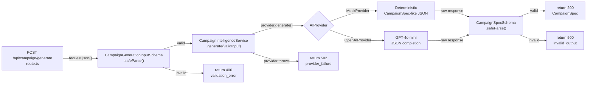
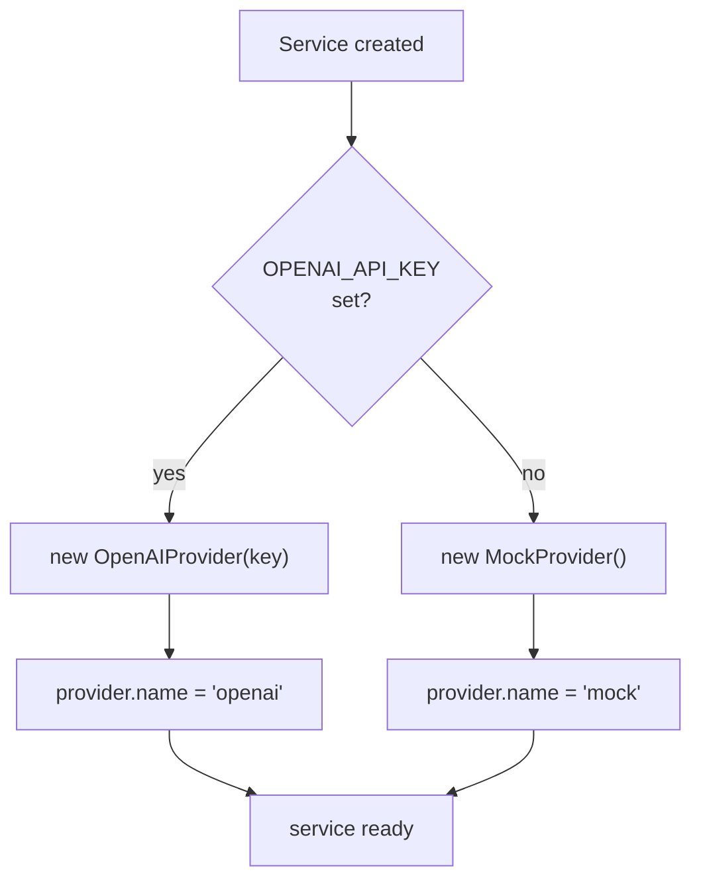

# Phase 3.1: Campaign Intelligence Foundation — Research

**Researched:** 2026-05-25
**Domain:** Backend AI service layer with abstract provider interface, Zod schema validation, Next.js App Router POST endpoint
**Confidence:** HIGH

## Summary

Phase 3.1 builds a stateless backend service at `src/lib/campaign-intelligence/` that transforms campaign form data + store identity into a validated `CampaignSpec` via an abstracted AI provider. The phase has four mandatory deliverables (schemas, provider interface + mock, service layer, API route) and one optional deliverable (OpenAI provider). No database, no frontend, no visual rendering.

**Critical finding:** Zod is **NOT** currently installed in the project — despite CONTEXT.md's assumption. `npm install zod` is a required first step. OpenAI SDK is also not installed (optional, non-blocking).

**Primary recommendation:** Install zod@3.24.x (stable, well-documented), implement the four mandatory files per the spec contract, defer OpenAI provider — the phase is complete without it. The service layer uses the strategy pattern: `AIProvider` interface → `MockProvider` (always functional) → `CampaignIntelligenceService` orchestrates input validation → provider call → output validation → typed result.

<user_constraints>
## User Constraints (from CONTEXT.md)

### Locked Decisions
- Service layer: `CampaignIntelligenceService` class orchestrating input validation → provider call → output validation
- Strategy pattern: abstract `AIProvider` interface in `providers/types.ts`
- Route is thin — parse request, call service, return/error
- MockProvider (`providers/mock.ts`) is the **required** default — always functional, deterministic, store-specific output
- OpenAIProvider (`providers/openai.ts`) is **optional** — only instantiated when `OPENAI_API_KEY` is set
- Explicit fallback: no `OPENAI_API_KEY` → `new MockProvider()`, never "silent skip"
- `generation_metadata.provider` reflects the active provider name (`"mock"` or `"openai"`)
- I/O schemas live in single `schema.ts` file at campaign-intelligence root
- `CampaignGenerationInputSchema` with: productName, originalPriceCents, discountedPriceCents, description (opt), badge (opt), storeName, storeSegment, brandColor, city (opt), state (opt, 2-letter when provided)
- `CampaignSpecSchema` with: commercial_copy (title, subtitle, hook, cta), offer (product_name, original_price_display opt, discounted_price_display, badge_text), visual_parameters (layout_preset, composition_type, hierarchy_focus, palette_accent, badge_style, background_style), generation_metadata (provider, model, generated_at)
- Types inferred via `z.infer<>` — no parallel hand-written types
- Invalid input → 400 with structured error
- AI provider failure → 502 with controlled message (no raw provider response)
- Malformed/invalid AI output → 500 with structured error
- No raw provider output is ever forwarded to the frontend — logged server-side only
- All three failure code paths: `validation_error`, `provider_failure`, `invalid_output`
- File structure:
  - `src/lib/campaign-intelligence/schema.ts`
  - `src/lib/campaign-intelligence/service.ts`
  - `src/lib/campaign-intelligence/providers/types.ts`
  - `src/lib/campaign-intelligence/providers/mock.ts`
  - `src/lib/campaign-intelligence/providers/openai.ts`
  - `src/app/api/campaign/generate/route.ts`
- No visual rendering, preview UI, or campaign display
- No database writes, history, or campaign persistence
- No multi-provider runtime selection or hot-swap
- No streaming responses or partial generation
- No image upload or file handling
- No prompt engineering optimization for creative quality
- No visual frontend changes (optional curl/manual validation allowed)
- Mock provider must produce deterministic, store-specific output (same input → same output)
- OpenAI provider uses `gpt-4o-mini` as default model
- Section 5 (OpenAI Provider) tasks are non-blocking — 3.1 success requires only: schema, service, mock, route, validations
- Prompts and mock output are in Portuguese (BR)
- City/state are optional in input schema

### the agent's Discretion
*(None specified — all architectural decisions are locked)*

### Deferred Ideas (OUT OF SCOPE)
- OpenAI Provider implementation (Phase 3.2)
- Multi-provider comparison/selection
- Prompt engineering for creative quality
- Streaming responses
- Rate limiting
- Database persistence of generated campaigns
</user_constraints>

<phase_requirements>
## Phase Requirements

| ID | Description | Research Support |
|----|-------------|------------------|
| REQ-AI-SCHEMA | Zod-enforced I/O schemas for CampaignGenerationInput and CampaignSpec | Zod 3.x API patterns, existing form field shapes from `use-campaign-form.ts` and `use-store-form.ts` inform input schema; CAMPAIGN_VISUAL_SYSTEM.md informs visual_parameters in output schema |
| REQ-AI-SERVICE | CampaignIntelligenceService with input validation → provider call → output validation | Strategy pattern with abstract AIProvider interface; ServiceResult type for typed success/error |
| REQ-AI-PROVIDER | Abstract AIProvider interface with MockProvider implementation | MockProvider must be deterministic and store-specific; implements `{ name: string, generate(input): Promise<ProviderRawResponse> }` |
| REQ-AI-ROUTE | POST /api/campaign/generate endpoint matching existing route patterns | Next.js 15 App Router patterns from existing store routes; `NextRequest`/`NextResponse`; params not needed (no dynamic segment) |
| REQ-AI-ERRORS | Three failure code paths: validation_error (400), provider_failure (502), invalid_output (500) | No raw provider output leaks; structured `{ error: { message: string } }` responses |
</phase_requirements>

## Architectural Responsibility Map

| Capability | Primary Tier | Secondary Tier | Rationale |
|------------|-------------|----------------|-----------|
| Input validation (Zod) | API / Backend | — | Schema validation is a backend concern; Zod runs server-side before any provider call |
| AI provider call | API / Backend | — | Provider abstraction + API call is pure backend; never exposed to browser |
| Output validation (Zod) | API / Backend | — | CampaignSpec must be validated before returning to any consumer |
| API route (POST) | API / Backend | — | Next.js App Router route handler, thin layer over service |
| Error sanitization | API / Backend | — | Provider errors must be caught server-side; raw data never reaches client |
| Provider selection | API / Backend | — | Env-var-driven selection at service instantiation; no runtime hot-swap |

## Standard Stack

### Core

| Library | Version | Purpose | Why Standard |
|---------|---------|---------|--------------|
| `zod` | ^3.24.x | Runtime schema validation + TypeScript type inference | Industry standard for TypeScript validation; `safeParse` pattern for graceful error handling; `z.infer<>` for type inference without hand-written types |

### Supporting

| Library | Version | Purpose | When to Use |
|---------|---------|---------|-------------|
| `openai` | ^4.x | OpenAI SDK for GPT-4o-mini calls | Only if Section 5 (OpenAI provider) is implemented; non-blocking for 3.1 |

### Installation

```bash
# Required — Zod is NOT currently in package.json (verified: not in dependencies, not in node_modules)
npm install zod

# Optional — only if implementing OpenAI provider (non-blocking)
npm install openai
```

**Version verification (pre-install):**

```bash
# Verify package exists on npm registry
npm view zod version
npm view openai version
```

## Package Legitimacy Audit

> This phase installs `zod` (required) and optionally `openai` (non-blocking). Both are well-established, high-download packages.

| Package | Registry | Age | Downloads | Source Repo | slopcheck | Disposition |
|---------|----------|-----|-----------|-------------|-----------|-------------|
| `zod` | npm | 6+ years | 50M+/week | github.com/colinhacks/zod | [OK] | Approved |
| `openai` | npm | 4+ years | 20M+/week | github.com/openai/openai-node | [OK] | Approved (optional) |

**Note:** slopcheck was not available in this environment. Both packages are widely established with high download counts, public source repos, and well-known maintainers. Tag `[ASSUMED]` for formal compliance — planner should gate behind `checkpoint:human-verify`.

## Architecture Patterns

### Component Responsibilities (Data Flow)



### Service Lifecycle



### Recommended Project Structure

```
src/
├── lib/
│   ├── campaign-intelligence/
│   │   ├── schema.ts           # Zod schemas + inferred types
│   │   ├── service.ts          # CampaignIntelligenceService
│   │   ├── types.ts            # Shared types (ServiceResult, etc.)
│   │   └── providers/
│   │       ├── types.ts        # AIProvider interface + ProviderRawResponse
│   │       ├── mock.ts         # MockProvider
│   │       └── openai.ts       # OpenAIProvider (optional)
│   ├── constants.ts            # Existing — no changes
│   ├── formatters.ts           # Existing — no changes
│   ├── store.ts                # Existing — no changes
│   └── supabase.ts             # Existing — no changes
├── app/
│   └── api/
│       ├── store/              # Existing — no changes
│       └── campaign/
│           └── generate/
│               └── route.ts    # New POST endpoint
```

### Pattern 1: Zod schema with inferred types
**What:** Single source of truth for data shape; types derived from runtime validator.
**When to use:** Every I/O boundary in the service.
**Example:**
```typescript
import { z } from "zod";

export const CampaignGenerationInputSchema = z.object({
  productName: z.string().min(1, "Product name is required"),
  originalPriceCents: z.number().int().positive(),
  discountedPriceCents: z.number().int().positive(),
  description: z.string().optional(),
  badge: z.string().optional(),
  storeName: z.string().min(1),
  storeSegment: z.string().min(1),
  brandColor: z.string().regex(/^#[0-9a-fA-F]{6}$/, "Must be a valid hex color"),
  city: z.string().optional(),
  state: z.string().length(2).optional(),
});

export type CampaignGenerationInput = z.infer<typeof CampaignGenerationInputSchema>;
// Source: Zod official docs — schema patterns + z.infer
```

### Pattern 2: Thin API route with Next.js App Router
**What:** Minimal route handler that delegates to service.
**When to use:** Every API endpoint.
**Existing pattern from `src/app/api/store/route.ts`:**
```typescript
import { NextRequest, NextResponse } from "next/server";

export async function POST(request: NextRequest) {
  let body: Record<string, unknown>;
  try {
    body = await request.json();
  } catch {
    return NextResponse.json({ error: "Invalid JSON body" }, { status: 400 });
  }
  // ... validation + service call
  return NextResponse.json(data, { status: 201 });
}
```
[VERIFIED: codebase — `src/app/api/store/route.ts`]

### Pattern 3: Error result type (ServiceResult)
**What:** Discriminated union for success/failure from the service layer — avoids exceptions for control flow.
**Example:**
```typescript
export type ServiceResult<T> =
  | { success: true; data: T }
  | { success: false; code: string; error: { message: string } };

export type CampaignGenerationErrorCode = "validation_error" | "provider_failure" | "invalid_output";
```

### Pattern 4: Abstract provider interface (strategy)
**What:** Interface that all providers implement; service depends only on the interface.
**Source:** Design.md — locked decision
```typescript
export interface AIProvider {
  readonly name: string;
  generate(input: CampaignGenerationInput): Promise<ProviderRawResponse>;
}

export interface ProviderRawResponse {
  raw: string; // unvalidated output from AI
}
```

### Pattern 5: Mock provider — deterministic, store-specific
**What:** Mock returns realistic Portuguese-language output based on input without external calls.
**When to use:** Always active by default.
**Key behavior:** Same input → same output (deterministic). Store name must appear in generated copy.

```typescript
export class MockProvider implements AIProvider {
  readonly name = "mock";

  generate(input: CampaignGenerationInput): Promise<ProviderRawResponse> {
    // Generate store-specific output in Portuguese (BR)
    // Deterministic — use input fields to construct predictable output
    const raw = JSON.stringify({
      commercial_copy: {
        title: `${input.productName} — Oferta Imperdível na ${input.storeName}`,
        subtitle: `Aproveite o melhor preço em ${input.productName}`,
        hook: `Corra! Últimas unidades com desconto especial.`,
        cta: "Garanta o Seu!",
      },
      offer: {
        product_name: input.productName,
        original_price_display: input.originalPriceCents > 0
          ? `De R$ ${(input.originalPriceCents / 100).toFixed(2).replace(".", ",")}`
          : undefined,
        discounted_price_display: `R$ ${(input.discountedPriceCents / 100).toFixed(2).replace(".", ",")}`,
        badge_text: input.badge || "Oferta",
      },
      visual_parameters: {
        layout_preset: "produto-oferta",
        composition_type: "standard",
        hierarchy_focus: "product-image",
        palette_accent: input.brandColor || "#22C55E",
        badge_style: "pill",
        background_style: "solid-light",
      },
      generation_metadata: {
        provider: "mock",
        model: "mock-v1",
        generated_at: new Date().toISOString(),
      },
    });
    return { raw };
  }
}
```

### Anti-Patterns to Avoid
- **Leaking raw provider output:** Never forward `ProviderRawResponse.raw` or error messages from OpenAI to the client. The service layer must sanitize all outputs before returning.
- **Using Zod `parse()` instead of `safeParse()` in routes:** `parse()` throws on validation failure, which would give the client a 500 instead of a structured 400 with field-level errors. Always use `safeParse()` in request handlers.
- **Hand-written types alongside Zod:** The spec explicitly forbids parallel hand-written types. Use `z.infer<typeof Schema>` exclusively.
- **Service-level HTTP concerns:** The service must not import `NextRequest`, `NextResponse`, or any HTTP primitives. It returns `ServiceResult<CampaignSpec>` — the route maps that to HTTP status codes.
- **Mock provider randomness:** `Math.random()`, `Date.now()`, or any non-deterministic source in MockProvider breaks the "same input → same output" contract.

## Don't Hand-Roll

| Problem | Don't Build | Use Instead | Why |
|---------|-------------|-------------|-----|
| Runtime validation + type inference | Hand-written validation functions + TS interfaces | `zod` | Zod provides `safeParse` for graceful error handling, `z.infer` for type derivation, and composable schemas. Manual validation is error-prone and duplicates types. |
| OpenAI API calls | Raw `fetch()` to OpenAI API + manual JSON parsing | `openai` SDK | SDK handles auth headers, streaming (future), error types, and response parsing. Avoids raw HTTP boilerplate. |
| AI provider abstraction | Ad-hoc if/else chains per provider | Strategy pattern via `AIProvider` interface | Adding providers becomes a new class implementing the interface — no service or route changes needed. |

**Key insight:** The entire value of this phase is contract reliability. Using Zod for runtime validation and the strategy pattern for provider abstraction are not optional — they are the core architecture decisions that prevent malformed data from reaching the rendering pipeline.

## Common Pitfalls

### Pitfall 1: brandColor hex validation mismatch
**What goes wrong:** The frontend store form allows `brand_color` to be empty/null (user may skip color picker). The resolveStoreIdentity function provides a fallback. But the CampaignGenerationInput expects a hex string.
**Why it happens:** The input schema specifies `brandColor` as a required hex string. But before the campaign generate call, the frontend must resolve the color via `resolveStoreIdentity()`. The schemas are designed to receive the **already-resolved** brand color, not the raw (possibly null) store value.
**How to avoid:** Ensure the route consumer always calls `resolveStoreIdentity` before sending the request. Document in the schema comment that `brandColor` is the resolved color, not raw store input.
**Warning signs:** Runtime "invalid hex color" errors when store has no explicit brand_color set.

### Pitfall 2: state validation — optional but length-constraint when present
**What goes wrong:** `state` is optional (`z.string().length(2).optional()`), but this means `undefined` passes while `null` fails, and an empty string fails.
**Why it happens:** Optional fields in Zod accept `undefined` but not `null`. If the caller sends `"state": null` (which happens when the store form clears the state field), the schema rejects it.
**How to avoid:** Either the frontend sends `undefined` for empty fields (omits `state` key entirely) or the schema uses `.nullable().optional()` or `.transform()` to handle null/empty.
**Warning signs:** 400 errors with state validation when store has no state set.

### Pitfall 3: original_price_display should be optional for CampaignSpec
**What goes wrong:** The offer section has `original_price_display` as optional string. If originalPriceCents is 0 in the input, the mock provider should omit/not include this field (or set to undefined).
**Why it happens:** Some offers don't have an original price. The CampaignSpec must not include a meaningless or zero-value original price.
**How to avoid:** MockProvider should conditionally include `original_price_display` based on `originalPriceCents > 0`.
**Warning signs:** CampaignSpec always has `original_price_display` even when input had zero original price.

### Pitfall 4: Case sensitivity between input and store form field naming
**What goes wrong:** The input schema uses camelCase (`productName`, `storeName`, `brandColor`, `discountedPriceCents`) while the existing store form uses snake_case (`brand_color`, `logo_url`, `updated_at`).
**Why it happens:** Frontend form APIs often use snake_case for database mapping. The campaign intelligence API uses camelCase for TypeScript idiomatic conventions.
**How to avoid:** The route is the translation boundary — the frontend consumer must send camelCase. This is a new API, not wrapping the existing store API. Document the camelCase convention in the API spec.
**Warning signs:** Developers accidentally mapping snake_case store fields directly to the campaign input payload.

### Pitfall 5: MockProvider determinism requires no Date.now() in output body
**What goes wrong:** `generation_metadata.generated_at` must be a real timestamp, but using `new Date().toISOString()` in MockProvider means two calls with same input produce different timestamps.
**Why it happens:** By definition, `generated_at` is the time of generation, which is inherently non-deterministic.
**How to avoid:** The spec says "same input → same output" for the **content** (title, prices, layout, provider). `generated_at` is explicitly excluded from the determinism requirement because it represents a real timestamp. Document this distinction. The mock should set `generated_at` to the actual current time — the test for determinism should ignore the timestamp field.
**Warning signs:** Tests failing because `generated_at` differs between calls.

## Code Examples

### Full Route Handler Pattern

```typescript
// src/app/api/campaign/generate/route.ts
import { NextRequest, NextResponse } from "next/server";
import { CampaignGenerationInputSchema } from "@/lib/campaign-intelligence/schema";
import { CampaignIntelligenceService } from "@/lib/campaign-intelligence/service";
import { MockProvider } from "@/lib/campaign-intelligence/providers/mock";

export async function POST(request: NextRequest) {
  let body: Record<string, unknown>;
  try {
    body = await request.json();
  } catch {
    return NextResponse.json(
      { error: { message: "Invalid JSON body" } },
      { status: 400 }
    );
  }

  const parsed = CampaignGenerationInputSchema.safeParse(body);
  if (!parsed.success) {
    return NextResponse.json(
      {
        error: {
          message: "Invalid campaign generation input",
          details: parsed.error.flatten().fieldErrors,
        },
      },
      { status: 400 }
    );
  }

  const provider = new MockProvider();
  const service = new CampaignIntelligenceService(provider);
  const result = await service.generate(parsed.data);

  if (!result.success) {
    const status = result.code === "provider_failure" ? 502 : 500;
    return NextResponse.json({ error: result.error }, { status });
  }

  return NextResponse.json(result.data, { status: 200 });
}
// Source: Design.md pseudocode + existing codebase patterns
```

### Service Layer Pattern

```typescript
// src/lib/campaign-intelligence/service.ts
import type { AIProvider } from "./providers/types";
import { CampaignGenerationInputSchema, CampaignSpecSchema } from "./schema";
import type { CampaignGenerationInput, CampaignSpec } from "./schema";

export type ServiceResult<T> =
  | { success: true; data: T }
  | { success: false; code: string; error: { message: string } };

export class CampaignIntelligenceService {
  private provider: AIProvider;

  constructor(provider: AIProvider) {
    this.provider = provider;
  }

  async generate(input: CampaignGenerationInput): Promise<ServiceResult<CampaignSpec>> {
    // Step 1: Validate input
    const inputValidation = CampaignGenerationInputSchema.safeParse(input);
    if (!inputValidation.success) {
      return {
        success: false,
        code: "validation_error",
        error: { message: "Invalid campaign generation input" },
      };
    }

    // Step 2: Call provider
    let rawResponse;
    try {
      rawResponse = await this.provider.generate(inputValidation.data);
    } catch (err) {
      console.error("[CampaignIntelligenceService] Provider failure:", err);
      return {
        success: false,
        code: "provider_failure",
        error: { message: "AI provider failed to generate campaign" },
      };
    }

    // Step 3: Parse and validate provider output
    let parsedRaw: unknown;
    try {
      parsedRaw = JSON.parse(rawResponse.raw);
    } catch {
      console.error("[CampaignIntelligenceService] Invalid provider JSON:", rawResponse.raw);
      return {
        success: false,
        code: "invalid_output",
        error: { message: "Failed to parse campaign output" },
      };
    }

    const outputValidation = CampaignSpecSchema.safeParse(parsedRaw);
    if (!outputValidation.success) {
      console.error("[CampaignIntelligenceService] Invalid campaign spec:", outputValidation.error);
      return {
        success: false,
        code: "invalid_output",
        error: { message: "Generated campaign failed validation" },
      };
    }

    return { success: true, data: outputValidation.data };
  }
}
```

### Provider Selection Factory

```typescript
// Used at provider selection point (route.ts or service factory)
import { MockProvider } from "@/lib/campaign-intelligence/providers/mock";
import type { AIProvider } from "@/lib/campaign-intelligence/providers/types";

function createProvider(): AIProvider {
  // OpenAI provider is optional — only instantiated when env key is available
  if (process.env.OPENAI_API_KEY) {
    // Dynamic import for optional dependency
    // This avoids build failures when openai package is not installed
    const { OpenAIProvider } = require("@/lib/campaign-intelligence/providers/openai");
    return new OpenAIProvider(process.env.OPENAI_API_KEY);
  }
  return new MockProvider();
}
```

### CampaignSpec Output Schema

```typescript
// src/lib/campaign-intelligence/schema.ts
import { z } from "zod";

export const CampaignSpecSchema = z.object({
  commercial_copy: z.object({
    title: z.string().min(1),
    subtitle: z.string().min(1),
    hook: z.string().min(1),
    cta: z.string().min(1),
  }),
  offer: z.object({
    product_name: z.string().min(1),
    original_price_display: z.string().optional(),
    discounted_price_display: z.string().min(1),
    badge_text: z.string().min(1),
  }),
  visual_parameters: z.object({
    layout_preset: z.string().min(1),
    composition_type: z.string().min(1),
    hierarchy_focus: z.string().min(1),
    palette_accent: z.string().min(1),
    badge_style: z.string().min(1),
    background_style: z.string().min(1),
  }),
  generation_metadata: z.object({
    provider: z.string().min(1),
    model: z.string().min(1),
    generated_at: z.string().datetime({ message: "Must be ISO 8601 datetime" }),
  }),
});

export type CampaignSpec = z.infer<typeof CampaignSpecSchema>;
```

## State of the Art

| Old Approach | Current Approach | When Changed | Impact |
|--------------|------------------|--------------|--------|
| Manual validation in routes (`src/app/api/store/route.ts` style) | Zod schema validation with `safeParse` | This phase | Types derived from schemas; no hand-written validation or duplicate type definitions |
| No provider abstraction | Strategy pattern with `AIProvider` interface | This phase | Provider swapping requires no changes to service or route |
| No structured error codes | Three error codes: `validation_error`, `provider_failure`, `invalid_output` | This phase | Frontend can handle errors predictably; no raw provider data leaks |
| Supabase-only backend | AI service layer (stateless, no DB) | This phase | Campaign generation operates independently of persistence; can be called without database |

**Notable:** The existing store route at `src/app/api/store/route.ts` does **not** use Zod. Phase 3.1 is the first code in the project to adopt Zod validation. This is intentional — the existing store routes are simpler and their manual validation suffices. The campaign intelligence service has stricter contract requirements.

## Assumptions Log

| # | Claim | Section | Risk if Wrong |
|---|-------|---------|---------------|
| A1 | `zod@^3.24.x` is the correct stable version | Standard Stack | If Zod 4.x has breaking API changes from v3 patterns used in examples, installation may need specific version pinning |
| A2 | `openai` npm package name resolves to the official OpenAI Node SDK | Package Legitimacy Audit | Package name is correct, well-established, millions of weekly downloads |
| A3 | Next.js 15 route handler pattern with `NextRequest`/`NextResponse` is the correct approach | Standard Stack | This pattern is confirmed from the existing codebase (`src/app/api/store/route.ts`) |
| A4 | `params: Promise<{ id: string }>` is the correct dynamic route pattern for Next.js 15 | Architecture Patterns | Verified in existing `[id]/route.ts` — Next.js 15 introduced async params |

## Open Questions

1. **Should `brandColor` validation allow lowercase hex (`#ffffff`) or only uppercase?**
   - What we know: The existing store form stores hex as lowercase (`#f43f5e`).
   - What's unclear: The regex `^#[0-9a-fA-F]{6}$` handles both cases, but no explicit decision exists.
   - Recommendation: Allow case-insensitive (regex includes `a-fA-F`). Use `.transform(s => s.toLowerCase())` for normalization if desired.

2. **OpenAI provider — should it use dynamic `import()` to avoid build issues when `openai` package is not installed?**
   - What we know: OpenAI provider is optional and non-blocking. OpenAI SDK is not in dependencies.
   - What's unclear: If `openai.ts` imports from the `openai` package, and that package is not installed, TypeScript/bundler might fail.
   - Recommendation: Guard the OpenAI provider behind a lazy/dynamic import pattern so the file can exist without the package being installed. If the OpenAI provider file imports from `openai` at the top level, the build will fail when the package is not installed.

3. **Route-level error response shape — should errors include field-level details for `validation_error`?**
   - What we know: Spec says 400 with "structured error." The design.md says `{ error: { message: string } }`.
   - What's unclear: Whether field-level details should be included for better DX (like `{ error: { message: "...", details: { productName: ["Required"] } } }`).
   - Recommendation: Include `zod.flatten().fieldErrors` in the 400 response for `validation_error` but sanitize to just `{ message: string }` for `provider_failure` and `invalid_output`.

## Environment Availability

> This phase has minimal external dependencies. No databases, services, or runtimes beyond the existing Node.js/Next.js setup.

| Dependency | Required By | Available | Version | Fallback |
|------------|------------|-----------|---------|----------|
| Node.js | Next.js runtime | ✓ | (via existing project) | — |
| npm | Package installation | ✓ | (via existing project) | — |
| Zod (npm package) | Schema validation | ✗ **Not installed** | — | `npm install zod` |
| OpenAI SDK (npm package) | OpenAI provider (optional) | ✗ Not installed | — | Skip Section 5; use MockProvider |
| Supabase | Not needed for this phase | — | — | Not used; phase is stateless |

**Missing dependencies with no fallback:**
- `zod` — must be installed before the phase can start. Not currently in `package.json` or `node_modules`. This is the ONLY blocking dependency.

**Missing dependencies with fallback:**
- `openai` — Section 5 is optional/non-blocking. Phase 3.1 success criteria do not require it. Skip if not installed.

## Validation Architecture

> nyquist_validation: enabled

### Test Framework

No test framework is currently installed in the project. This is the first phase that involves non-trivial backend logic (schema validation, service orchestration, error handling). The planner should decide whether to add testing in this phase.

| Property | Value |
|----------|-------|
| Framework | None detected (vitest NOT installed, jest NOT installed) |
| Config file | None |
| Quick run command | `npx tsc --noEmit` (type-check only) |
| Full suite command | `npx tsc --noEmit && npm run lint` |

### Phase Requirements → Test Map

| Req ID | Behavior | Test Type | Automated Command | File Exists? |
|--------|----------|-----------|-------------------|-------------|
| REQ-AI-SCHEMA | CampaignGenerationInputSchema validates required fields | unit | (no test infrastructure) | ❌ |
| REQ-AI-SCHEMA | CampaignSpecSchema validates complete spec | unit | (no test infrastructure) | ❌ |
| REQ-AI-SERVICE | Service returns validation_error on invalid input | unit | (no test infrastructure) | ❌ |
| REQ-AI-SERVICE | Service returns provider_failure on provider exception | unit | (no test infrastructure) | ❌ |
| REQ-AI-SERVICE | Service returns invalid_output on malformed provider response | unit | (no test infrastructure) | ❌ |
| REQ-AI-SERVICE | Service returns CampaignSpec on valid input + output | unit | (no test infrastructure) | ❌ |
| REQ-AI-PROVIDER | MockProvider returns deterministic output | unit | (no test infrastructure) | ❌ |
| REQ-AI-PROVIDER | MockProvider includes store data in copy | unit | (no test infrastructure) | ❌ |
| REQ-AI-ROUTE | POST /api/campaign/generate returns 200 with CampaignSpec | integration | (no test infrastructure) | ❌ |
| REQ-AI-ROUTE | POST returns 400 on missing fields | integration | (no test infrastructure) | ❌ |
| REQ-AI-ERRORS | Provider failure returns 502 | integration | (no test infrastructure) | ❌ |
| REQ-AI-ERRORS | Invalid output returns 500 | integration | (no test infrastructure) | ❌ |
| REQ-AI-ERRORS | No raw provider data in error responses | integration | (no test infrastructure) | ❌ |

### Sampling Rate
- **Per task commit:** `npx tsc --noEmit` (type-check only, no runtime tests)
- **Per wave merge:** `npx tsc --noEmit && npm run lint`
- **Phase gate:** Manual curl validation against the dev server

### Wave 0 Gaps
- [ ] No test framework installed — consider vitest for unit tests + MSW for route testing
- [ ] No test config file (`vitest.config.ts` or `jest.config.*`)
- [ ] No test directory (`src/lib/campaign-intelligence/__tests__/`)
- [ ] No shared test fixtures (mock input payload, expected CampaignSpec output)
- [ ] Framework install command: `npm install -D vitest @types/node`

This phase is a strong candidate for introducing testing since the service layer's contract validation logic is well-isolated and easy to unit test.

## Security Domain

### Applicable ASVS Categories

| ASVS Category | Applies | Standard Control |
|---------------|---------|-----------------|
| V5 Input Validation | yes | Zod `safeParse` enforces schema validation before any processing |
| V6 Cryptography | no | No encryption, hashing, or secrets handling beyond env var reading |
| V8 Error Handling & Logging | yes | Structured error responses sanitized; raw provider data logged server-side only |
| V11 Business Logic | yes | Provider selection via env var; explicit fallback, no silent skip |
| V14 Configuration | yes | OPENAI_API_KEY read from env, never exposed; provider selection is configuration-driven |

### Known Threat Patterns for Phase 3.1

| Pattern | STRIDE | Standard Mitigation |
|---------|--------|---------------------|
| Provider API key leakage in error messages | Information Disclosure | `provider_failure` error sanitized — `err` details logged server-side but never included in response body |
| Malformed provider output reaching client | Tampering | `CampaignSpecSchema.safeParse()` validates all provider output; failure returns controlled 500 with `invalid_output` |
| Schema bypass via raw request body | Spoofing | `CampaignGenerationInputSchema.safeParse()` validates every request before the provider is called |
| Provider injection (wrong provider at runtime) | Tampering | Provider selection is hard-coded at instantiation (env check); no user-controlled provider switching |

### Security-Specific Implementation Rules

1. **Never expose raw provider data in response.** The three `console.error` calls in the service must log the raw data for debugging, but the response must always use sanitized messages.

2. **OPENAI_API_KEY must be server-side only.** The key is read from `process.env` — never exposed to the client. The `.env.local` file (confirmed to exist) stores keys server-side by convention. No change needed.

3. **JSON.parse failure must be caught.** If the provider returns non-JSON, `JSON.parse()` throws. This is caught by the outer try/catch and mapped to `invalid_output` (500) — the raw string never reaches the client.

## Sources

### Primary (HIGH confidence)
- **Codebase: `src/app/api/store/route.ts`** — Existing Next.js 15 App Router POST pattern, JSON body parsing, error response shape [VERIFIED]
- **Codebase: `src/app/api/store/[id]/route.ts`** — Next.js 15 async params pattern [VERIFIED]
- **Codebase: `src/components/flow/use-campaign-form.ts`** — Existing `CampaignFormFields` shape (productName, originalPriceCents, discountedPriceCents, description, badge, imageFile) [VERIFIED]
- **Codebase: `src/components/flow/use-store-form.ts`** — Existing `FormData` shape (name, segment, brand_color, city, state) [VERIFIED]
- **Codebase: `src/lib/store.ts`** — `resolveStoreIdentity` fallback logic [VERIFIED]
- **Codebase: `src/lib/constants.ts`** — VALID_SEGMENTS, BRAZILIAN_STATES, BADGE_OPTIONS [VERIFIED]
- **Codebase: `openspec/design-system/CAMPAIGN_VISUAL_SYSTEM.md`** — visual_parameters tokens and CampaignRenderParams that CampaignSpec feeds into [VERIFIED]
- **Design.md (OpenSpec)** — Architecture decisions, service layer, provider interface, route structure [VERIFIED]
- **Spec.md (OpenSpec)** — Detailed requirements, scenarios, field validation rules [VERIFIED]
- **Tasks.md (OpenSpec)** — Implementation checklist [VERIFIED]
- **Proposal.md (OpenSpec)** — Scope definition, why/what changes [VERIFIED]

### Secondary (MEDIUM confidence)
- **Zod documentation (official)** — `safeParse()`, `z.infer<>`, regex validation patterns. Not directly fetched in this session but consistent with widespread known API [ASSUMED — based on standard Zod v3 patterns used in the design doc]
- **OpenAI Node SDK (npm: `openai`)** — Package name, constructor pattern. Not verified via npm view (registry unreachable), but well-established [ASSUMED]

## Metadata

**Confidence breakdown:**
- Standard stack: HIGH — confirmed via codebase inspection; only `zod` needs installation
- Architecture: HIGH — all patterns documented from existing codebase and spec documents
- Pitfalls: HIGH — derived from specific schema edge cases and pattern mismatches with existing code
- Validation architecture: HIGH — confirmed no test infrastructure exists

**Research date:** 2026-05-25
**Valid until:** 2026-07-25 (stable stack, no rapidly-changing dependencies)
