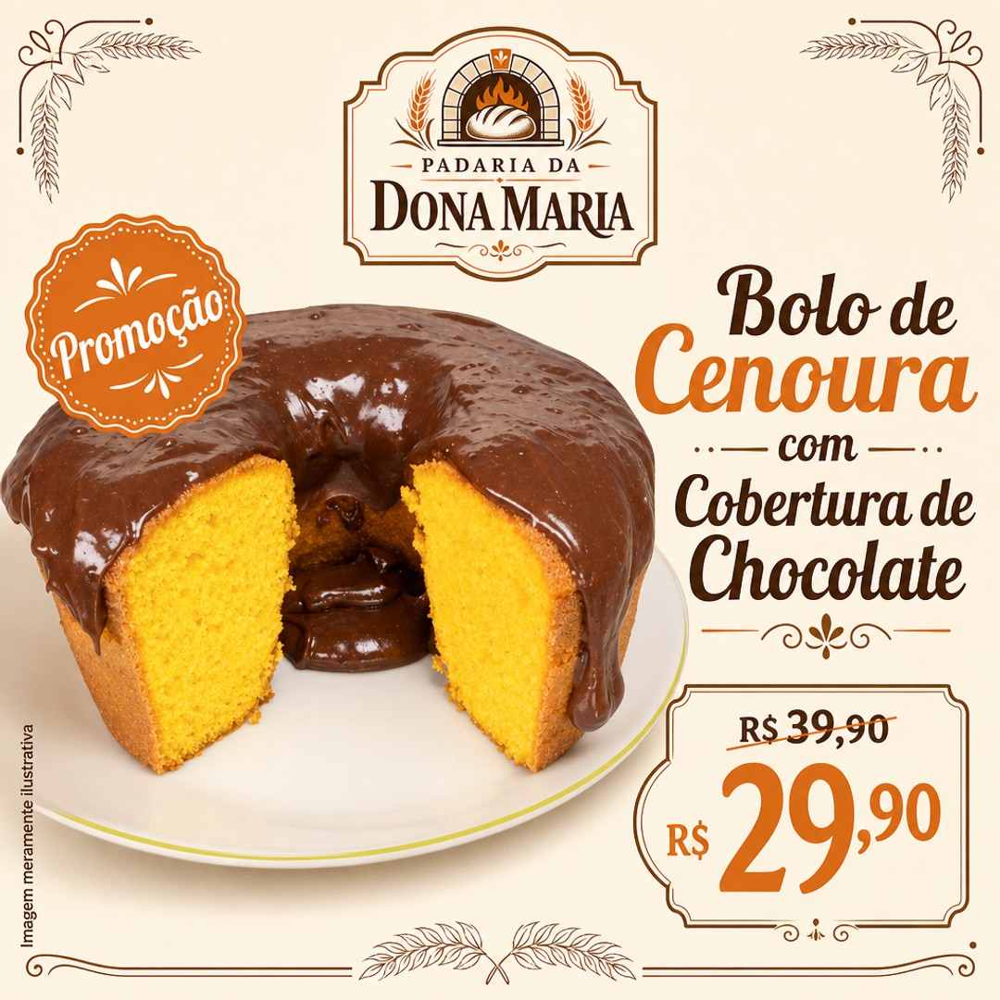
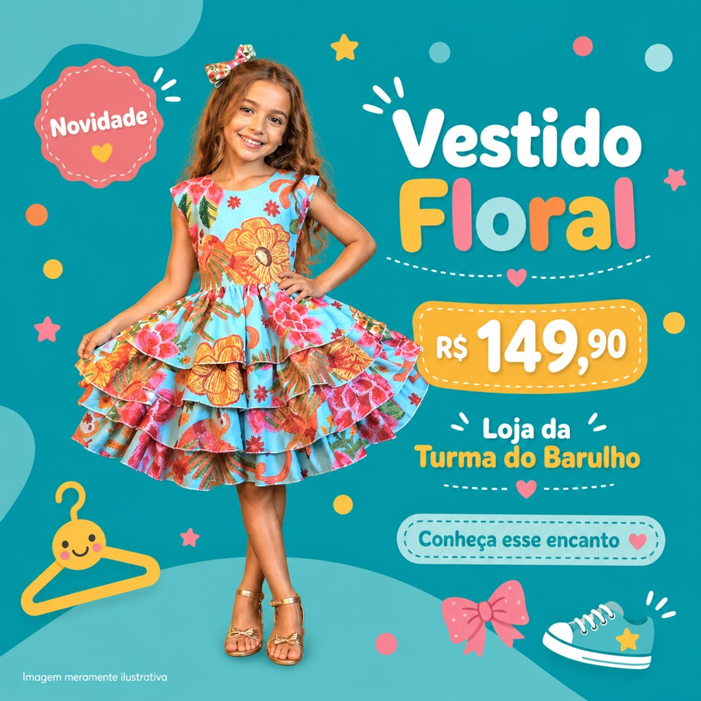
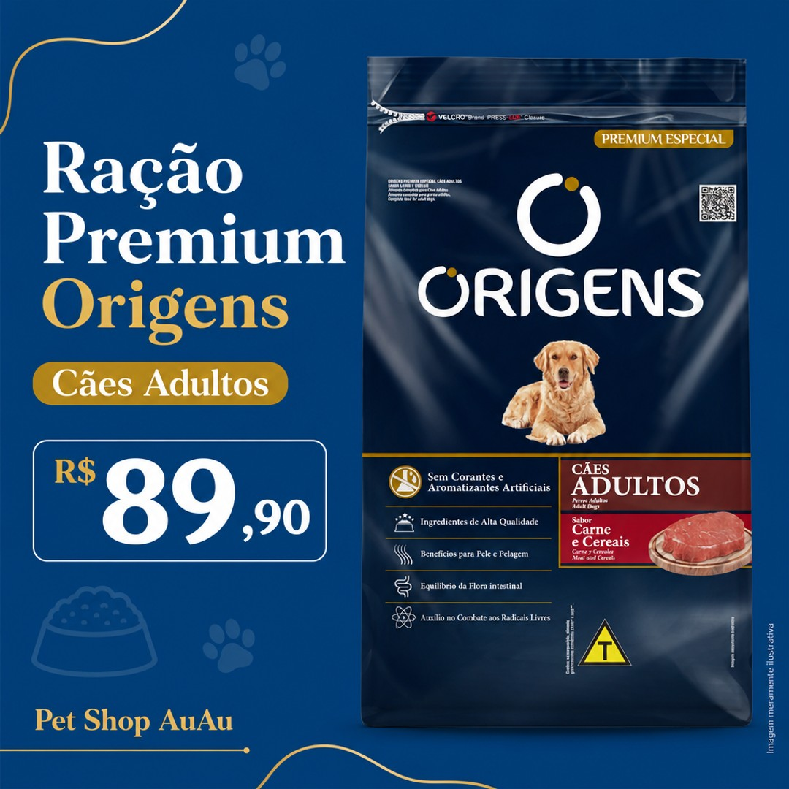
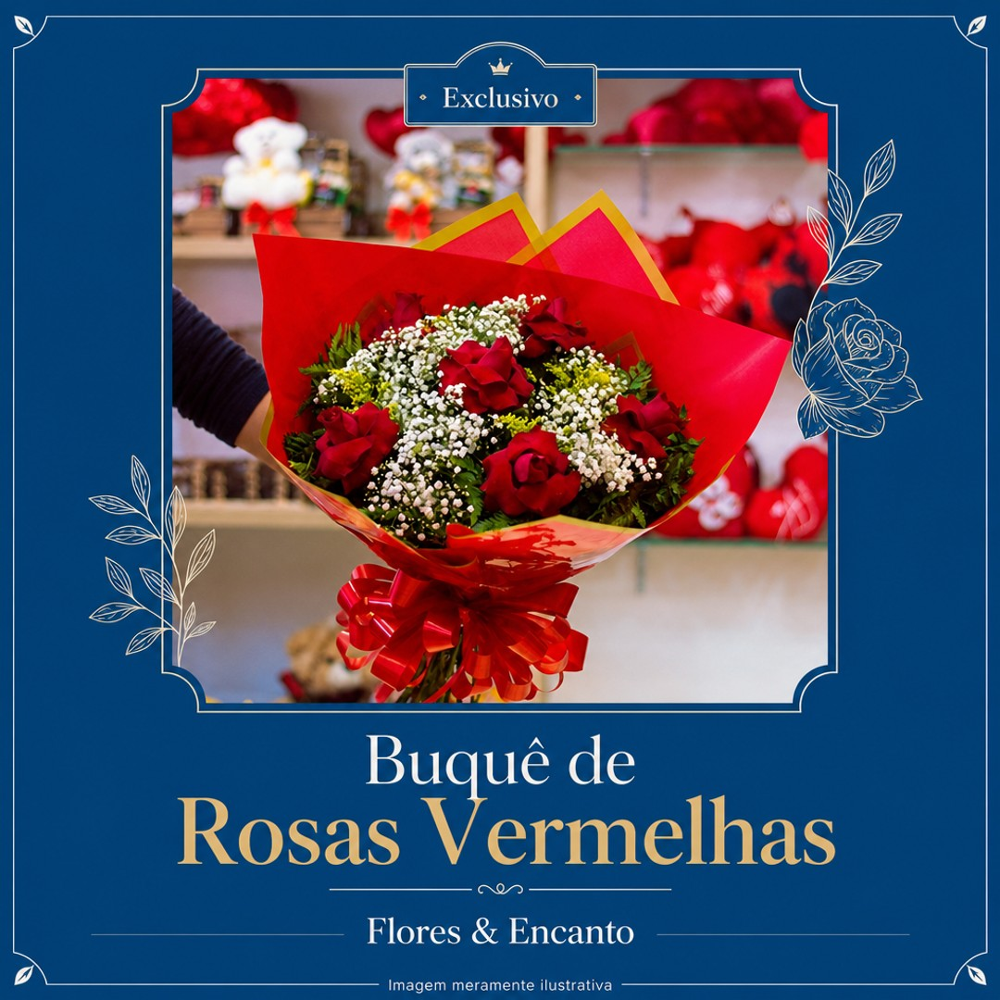
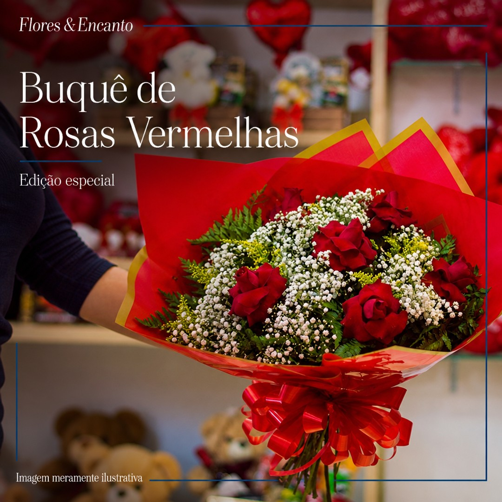
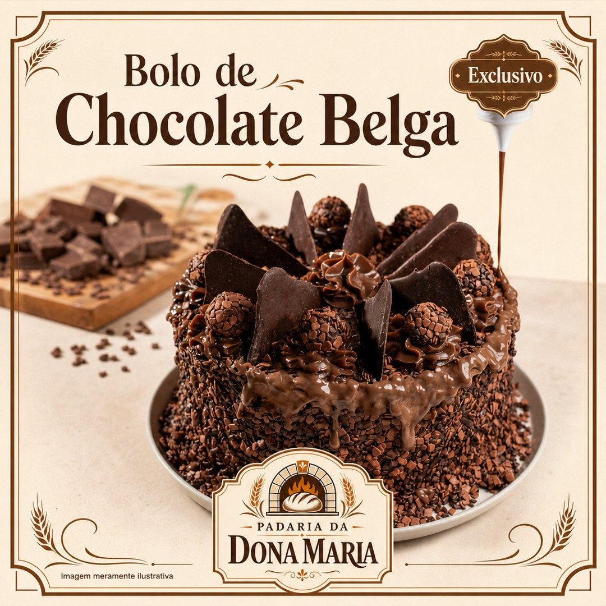

# UAT F31.3 — Evidências Consolidadas

> **Status:** Concluído — UAT executado com IA real, com ajuste validado no cenário D.1
> **Data de abertura:** 2026-07-25

## Sumário

| Cenário | Intent | Produto | Resultado Revisor | Parecer Manual | Retry | Link/Print |
|---------|--------|---------|-------------------|----------------|-------|------------|
| A | offer | Bolo de Cenoura (Padaria) | Passou | Aprovado | Não | image.png |
| B | spotlight | Vestido Floral (Moda) | Passou | Aprovado | Não | image-1.png |
| C | spotlight | Ração Premium (Pet Shop) | Passou | Aprovado | Não | image-2.png |
| D | exclusive | Buquê de Rosas (Flores) | Passou | Reprovado | Não | image-3.png |
| D.1 | exclusive | Buquê de Rosas (Flores) | Passou | Aprovado | Não | image-5.png |
| E | exclusive | Bolo de Chocolate Belga (Confeitaria) | Passou | Aprovado | Não | image-4.png |

---

## Micro-Runbook

### Pré-requisitos

1. OpenAI API key configurada em `.env.local` ou variável de ambiente
2. Aplicação rodando localmente (`npm run dev`)
3. Loja de teste configurada no banco (qualquer loja com visual signature ou text_only)

### Execução

Para cada cenário:

1. Acessar `/campanhas/nova`
2. Preencher formulário com os dados do cenário
3. Selecionar a intent correspondente
4. Submeter e aguardar geração
5. Inspecionar resultado visual
6. Registrar:

```json
{
  "cenario": "A",
  "input": { "productName": "...", "campaignIntent": "...", "discountedPriceCents": ..., "badgeText": "..." },
  "reviewOutput": { "passed": true/false, "issues": [], "failureType": null },
  "parecerManual": "publicável / não publicável",
  "motivo": "...",
  "retry": false
}
```

### Critérios de Aceite

- **Cenário A (offer):** Revisor aprova imagem com preço correto e badge presente. Sem falsos negativos.
- **Cenário B (spotlight + badge):** Revisor não exige badge obrigatório. Aceita preço único sem DE/POR. Não critica falta de urgência. Máximo minor issues.
- **Cenário C (spotlight sem badge):** Revisor não gera issue por falta de badge. Sem falsos positivos.
- **Cenário D (exclusive sem badge, preserve):** Revisor NÃO gera `wrong_price` por falta de preço. Não gera issue por falta de badge. Aceita fundo contextual.
- **Cenário D.1 (exclusive sem badge, preserve, pós-ajuste):** Valida correção do prompt do diretor. A imagem original permanece como base principal da peça, sem moldura/template dominante, com exclusividade comunicada sem preço ou urgência promocional.
- **Cenário E (exclusive + badge, preserve):** Revisor não gera `wrong_price`. Badge "Exclusivo" aceito (não gera `invented_badge`). Tom premium validado.

---

## Detalhamento por Cenário

### Cenário A — Offer (Regressão)

**Input:**
- **Loja:** Padaria da Dona Maria
- **Produto:** Bolo de Cenoura com Cobertura de Chocolate
- **Intent:** offer
- **Preço:** DE R$ 39,90 / POR R$ 29,90
- **Badge:** "Promoção"
- **preserveImageContext:** false

**Input JSON:**
```json
{
  "storeId": "<store-uuid>",
  "productName": "Bolo de Cenoura com Cobertura de Chocolate",
  "originalPriceCents": 3990,
  "discountedPriceCents": 2990,
  "campaignIntent": "offer",
  "badgeText": "Promoção",
  "productImageDataUrl": "<product-image>"
}
```

**Parecer do revisor:** Passou
**Parecer manual:** Aprovado
**Motivo:** Arte de impacto, com apelo de promoção, peças com peso visual equilibrado, preço em destaque 
**Retry:** não
**Evidência visual:** 
**Kit de Publicação:** Delicie-se com o nosso Bolo de Cenoura com Cobertura de Chocolate, feito com carinho e tradição. Aproveite a promoção: de R$ 39,90 por R$ 29,90! Venha sentir o sabor da infância na Padaria da Dona Maria. Não perca essa oportunidade deliciosa! - #BolodeCenoura #PromoçãoDeliciosa #PadariaDonaMaria #SaborTradicional - Corra, garanta o seu bolo agora!

---

### Cenário B — Spotlight + badge

**Input:**
- **Loja:** Loja da Turma do Barulho
- **Produto:** Vestido Floral
- **Intent:** spotlight
- **Preço:** R$ 149,90 (único, sem DE/POR)
- **Badge:** "Novidade"
- **preserveImageContext:** false

**Input JSON:**
```json
{
  "storeId": "<store-uuid>",
  "productName": "Vestido Floral",
  "discountedPriceCents": 14990,
  "campaignIntent": "spotlight",
  "badgeText": "Novidade",
  "productImageDataUrl": "<product-image>"
}
```

**Parecer do revisor:** Passou
**Parecer manual:** Aprovado
**Motivo:** a peça apresenta bom equilíbrio visual, com destaque ao produto e nome - o fundo foi recortado - peças bem distribuídas
**Retry:** não
**Evidência visual:** 
**Kit de Publicação:** Apresentamos o Vestido Floral da Loja da Turma do Barulho! Por apenas R$ 149,90, este vestidinho traz um toque de alegria e delicadeza para o guarda-roupa dos pequenos. Perfeito para criar memórias inesquecíveis e momentos de pura diversão! - #VestidoFloral #ModaInfantil #TurmaDoBarulho #InfânciaFeliz - Venha descobrir!

---

### Cenário C — Spotlight sem badge

**Input:**
- **Loja:** Pet Shop AuAu
- **Produto:** Ração Premium Origens Cães Adultos
- **Intent:** spotlight
- **Preço:** R$ 89,90 (único)
- **Badge:** (nenhum)
- **preserveImageContext:** false

**Input JSON:**
```json
{
  "storeId": "<store-uuid>",
  "productName": "Ração Premium para Cães Adultos",
  "discountedPriceCents": 8990,
  "campaignIntent": "spotlight",
  "productImageDataUrl": "<product-image>"
}
```

**Parecer do revisor:** Passou
**Parecer manual:** Aprovado
**Motivo:** Peça limpa, sem badge, bem distribuída - destaque para o produto mas com nom e preço bem visíveis
**Retry:** não
**Evidência visual:** 
**Kit de Publicação:** Apresentamos a Ração Premium Origens para cães adultos! Proporcione o melhor para o seu fiel companheiro com uma nutrição de qualidade. Disponível por apenas R$ 89,90 na Pet Shop AuAu, onde o cuidado e a confiança andam de patas dadas. - #RaçãoPremiumOrigens #PetShopAuAu #CuidadosComPets #CãesFelizes - Venha conhecer!

---

### Cenário D — Exclusive sem badge, preserve=true

**Input:**
- **Loja:** Flores & Encanto
- **Produto:** Buquê de Rosas Vermelhas
- **Intent:** exclusive
- **Preço:** (nenhum)
- **Badge:** (nenhum)
- **preserveImageContext:** true

**Input JSON:**
```json
{
  "storeId": "<store-uuid>",
  "productName": "Buquê de Rosas Vermelhas",
  "campaignIntent": "exclusive",
  "preserveImageContext": true,
  "productImageDataUrl": "<product-image>"
}
```

**Parecer do revisor:** Passou
**Parecer manual:** Reprovado
**Motivo:** arte carregada, a imagem foi enquadrada dentro de uma moldura azul roubando o destaque do produto, preferiria a imagem completa com nome e detalhes sobrepondo pontos da imagem com leve sombreamento sem comprometer o destaque que é o buquê
**Retry:** não
**Evidência visual:** 
**Kit de Publicação:** Descubra a essência do luxo com nosso Buquê de Rosas Vermelhas, uma criação exclusiva da Flores & Encanto. Cada pétala é um testemunho de elegância e dedicação, perfeita para realçar momentos verdadeiramente especiais. - #BuquêExclusivo #FloresSofisticadas #FloresEEncanto - Visite nossa loja!

---

### Cenário D.1 — Exclusive sem badge, preserve=true
### Após ajuste do prompt do diretor de campanha

**Input:**
- **Loja:** Flores & Encanto
- **Produto:** Buquê de Rosas Vermelhas
- **Intent:** exclusive
- **Preço:** (nenhum)
- **Badge:** (nenhum)
- **preserveImageContext:** true

**Input JSON:**
```json
{
  "storeId": "<store-uuid>",
  "productName": "Buquê de Rosas Vermelhas",
  "campaignIntent": "exclusive",
  "preserveImageContext": true,
  "productImageDataUrl": "<product-image>"
}
```

**Parecer do revisor:** Passou
**Parecer manual:** Aprovado
**Motivo:** a composição respeitou a imagem original, adicionou texto e contorno sem exagero - manteve o destaque do buquê e acrescentou "Edição especial" como indicação de exclusividade
**Retry:** não
**Evidência visual:** 
**Kit de Publicação:** Descubra a exclusividade do Buquê de Rosas Vermelhas da Flores & Encanto. Cada arranjo é cuidadosamente elaborado para capturar a essência da sofisticação e do encanto natural. Um item premium que transforma cada momento em uma lembrança inesquecível. - #BuquêExclusivo #FloresEncanto #Sofisticação - Descubra a exclusividade!

---

### Cenário E — Exclusive + badge, preserve=true

**Input:**
- **Loja:** Padaria da Dona Maria
- **Produto:** Bolo de Chocolate Belga
- **Intent:** exclusive
- **Preço:** (nenhum)
- **Badge:** "Exclusivo"
- **preserveImageContext:** true

**Input JSON:**
```json
{
  "storeId": "<store-uuid>",
  "productName": "Bolo de Chocolate Belga",
  "campaignIntent": "exclusive",
  "preserveImageContext": true,
  "badgeText": "Exclusivo",
  "productImageDataUrl": "<product-image>"
}
```

**Parecer do revisor:** Passou
**Parecer manual:** Aprovado
**Motivo:** a imagem fornecida foi levementa alterada, mas a composição ficou muito boa, preserva a imagem original do produto com pequenas adequações, sem comprometer a veracidade do original - produto comboma destaque - talez a assinatura visual da loja um pouco grande para uma arte premium, mas publicável mesmo assim
**Retry:** não
**Evidência visual:** 
**Kit de Publicação:**   Explore a excelência do nosso Bolo de Chocolate Belga, uma exclusividade da Padaria da Dona Maria. Feito com o mais puro cacau belga, cada fatia é uma experiência artesanal e memorável. Descubra a tradição e o carinho em cada detalhe. - #BoloDeChocolateBelga #Exclusividade #PadariaDonaMaria #Artesanal #Tradição - Visite-nos e experimente!
