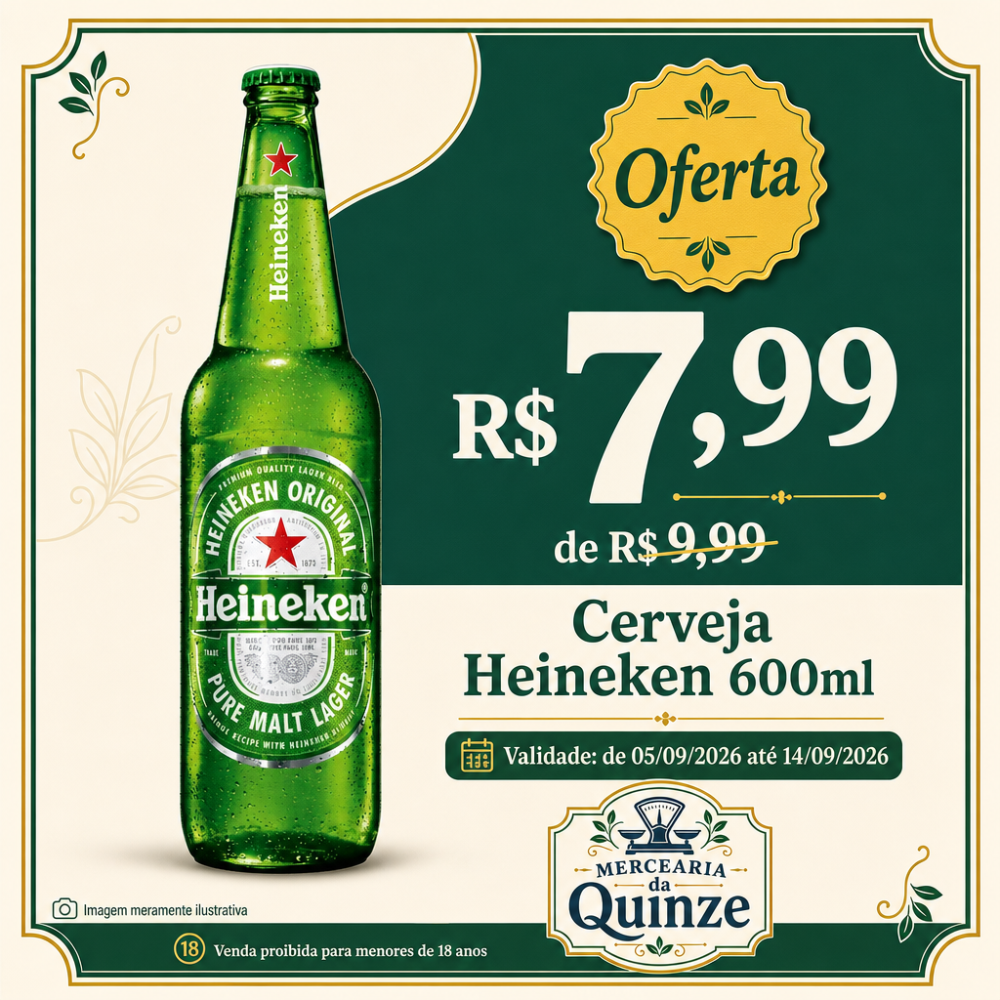
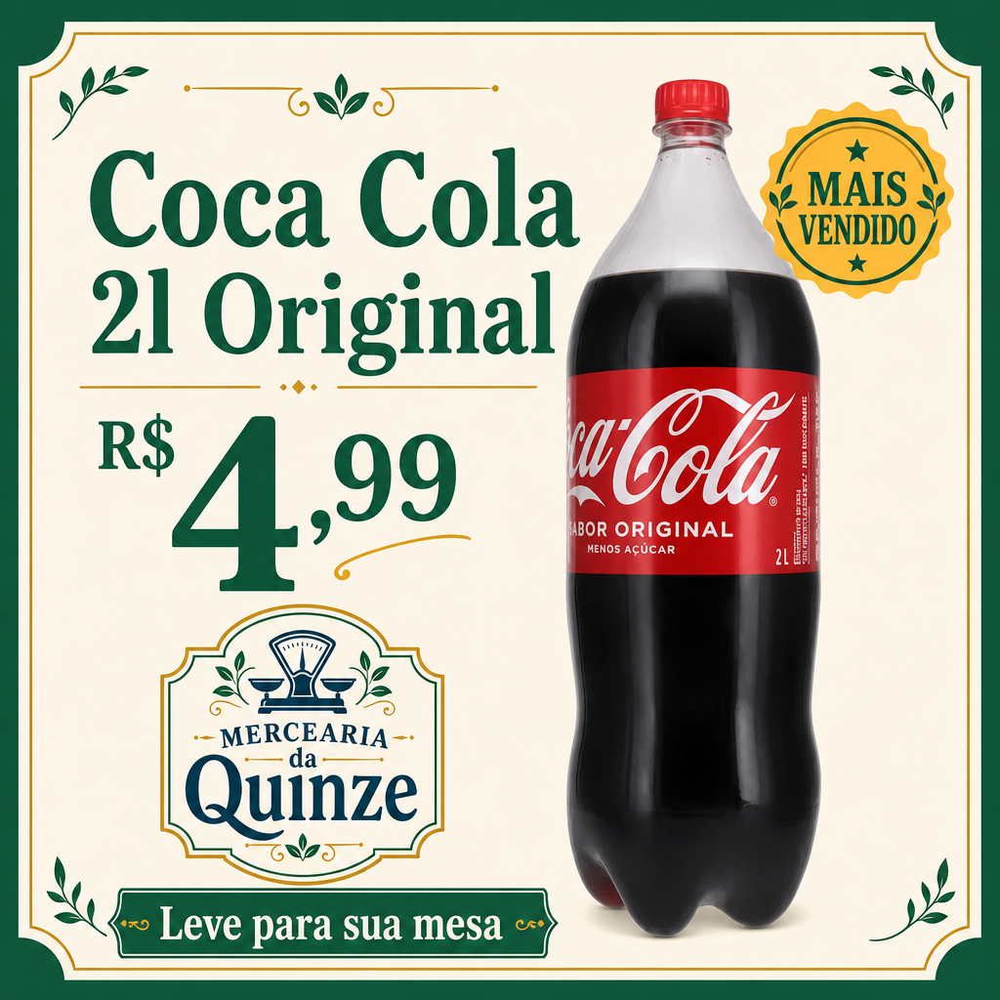

Input
6.269t
user
Diretrizes Criativas — Diretor de Marketing → Diretor de Arte
Briefing: Campanha Visual para Instagram
Você é o Diretor de Marketing da Mercearia da Quinze. Sua função é briefar o Diretor de Arte para criar uma campanha visual profissional para Instagram. A peça deve ser publicável, comercial e transmitir confiança ao lojista.

Fatos da Campanha
Loja: Mercearia da Quinze
Segmento: mercados-mercearias
Tom de voz: tradicional
Produto: Cerveja Heineken 600ml
Preço com desconto: R$ 7,99
Preço original: R$ 9,99
Badge: Oferta
Validade da oferta: de 05/09/2026 até 14/09/2026
Validade com data: se a validade informada contiver data, a arte DEVE exibir dia, mês e ano completos no formato dd/mm/aaaa conforme informado (ex.: "até 30/09/2026", "de 25/09/2026 até 30/09/2026"). NÃO trunque para dd/mm nem omita o ano. Não invente nem altere a data informada.

Especificações Técnicas
Formato: Quadrado 1:1 (Instagram feed)
Estilo: Plano, limpo, profissional — agência de publicidade
Idioma: Português brasileiro (PT-BR)
Paleta de cores da marca: #1F5A44
Diretrizes de Composição
Herói visual: O produto Cerveja Heineken 600ml deve ser o elemento central e mais proeminente da composição
Identidade da loja: A campanha deve ser assinada pela loja — ver a seção "Identidade da Loja"
Produto em destaque: O nome Cerveja Heineken 600ml deve ser exibido com destaque e legibilidade
Precificação: Exibir o preço com desconto informado nos fatos como preço principal. Quando houver preço original informado, exibi-lo como preço riscado (indicação de desconto)
Badge promocional: Quando houver badge promocional informado nos fatos, incorporá-lo à arte. Sem badge informado, não inventar selo, benefício ou promessa promocional
Hook e CTA: Quando houver hook e CTA informados nos fatos, incorporá-los na peça de forma orgânica e persuasiva. O CTA não deve repetir literalmente o texto do badge — com badge informado, o CTA complementa a chamada para ação sem redundância
Instruções Obrigatórias
NÃO inventar preços, descontos, condições de pagamento, prazos de entrega, garantias ou informações de disponibilidade que não estejam explícitas no briefing
NÃO utilizar informações de parcelamento, frete grátis ou condições comerciais não fornecidas
Todo texto deve estar em português brasileiro
A cor predominante deve seguir a paleta #1F5A44
Manter hierarquia visual clara: produto > preço > loja > call to action
Composição limpa e profissional, sem efeitos gráficos artificiais ou gradientes agressivos — luz natural, profundidade e sombras do produto são permitidas
A imagem gerada deve ser publicável como arte final de campanha — sem rascunhos, sem placeholders, sem elementos de interface
Produto e Imagens de Referência
Para campanhas de oferta, isole o produto do cenário original e apresente-o em fundo comercial limpo, preservando fielmente sua aparência. O fundo pode ser criado livremente, mas não deve manter o ambiente contextual da imagem de referência.

A imagem do produto é uma referência factual protegida.

Não redesenhe, reescreva, complete ou invente:

textos da embalagem;
selos;
certificações;
benefícios;
volume;
quantidade;
variante;
preço;
logotipo.
Caso algum texto pequeno da embalagem não possa ser reproduzido com fidelidade, preserve visualmente o produto sem tentar completar esse texto.

Você possui liberdade total para criar fundo, composição, iluminação, hierarquia, formas, elementos decorativos e direção visual.

Identidade da Loja
O nome Mercearia da Quinze deve aparecer como assinatura de marca — consistente com a identidade visual da loja.
Assinar a campanha com o assinatura visual da loja fornecido como imagem de referência, reproduzindo o ativo com fidelidade. NÃO editar, redesenhar, distorcer, reinterpretar, completar nem inventar elementos do ativo. Manter o assinatura visual integralmente dentro da área segura da arte, com margem visível nas quatro bordas — nenhuma parte relevante deve encostar, ultrapassar ou ficar cortada. A posição é livre na composição, desde que o assinatura visual permaneça legível, reconhecível e secundário ao conteúdo principal da peça.
Não adicionar logotipo além da assinatura visual fornecida.

Direção Criativa Contextual
Você é um diretor de marketing especializado em Mercados e Mercearias.

Categoria do Produto
O produto anunciado é da categoria: mercados-mercearias

Perfil de Marca (Store Brand Director)
Nota: Este perfil de marca é contexto criativo direcional para repertório da campanha, não regra obrigatória. Use como referência visual e comercial, preservando seu julgamento criativo na composição.
| Campo | Valor |
|-------|-------|
| Diretrizes de campanha | Campanhas devem valorizar os valores de tradição, confiança e proximidade. Utilize ícones e ilustrações que remetam ao universo clássico de mercearia, com linguagem visual acolhedora e tom de voz tradicional. Aposte em narrativas visuais que celebrem o bairro, histórias locais e clientes fiéis. |
| Brief do Diretor de Marca | Criar campanhas que evoquem a tradição e o charme das antigas mercearias de bairro, reforçando o sentimento de proximidade, confiança e preço justo. Usar sempre linguagem acessível e visual clássico, destacando produtos básicos e atendimento diferenciado. |
| Personalidade da marca | Marca simpática, confiável e próxima do cotidiano. O perfil é de uma mercearia que valoriza a tradição, administração familiar e atendimento personalizado. Predomina o espírito popular, acolhedor e acessível. |
| Estilo visual | O estilo visual é clássico e remete a um selo tradicional de mercearia de bairro, transmitindo a sensação de confiança, proximidade e tradição. Os elementos são organizados de forma simétrica e harmoniosa, reforçando o apelo nostálgico e popular. |
| Tom visual | O tom visual é acolhedor, acessível e familiar, com uma atmosfera vintage que faz referência às antigas mercearias de cidades menores. As ilustrações suaves de folhas e da balança evocam cuidado e atenção aos detalhes, transmitindo honestidade e simplicidade. |
| Cores da marca | #1F5A44, #F2C94C |

Texto Obrigatório na Arte
O texto abaixo foi informado pelo lojista para ser incluído na arte. Inclua esse texto na arte de forma visível e legível, em tipografia mínima adequada para leitura em dispositivo móvel. Não o repita na legenda.

"Venda proibida para menores de 18 anos"

Aviso Ilustrativo
Quando houver aviso ilustrativo, exiba-o em texto mínimo, legível e discreto, separado dos demais textos, preferencialmente nas laterais da arte.

Texto do aviso: "Imagem meramente ilustrativa"

Input
4.022t
user
Diretrizes Criativas — Diretor de Marketing → Diretor de Arte
Briefing: Campanha Visual para Instagram — Destaque
Você é o Diretor de Marketing da Mercearia da Quinze. Sua função é briefar o Diretor de Arte para criar uma campanha visual profissional para Instagram. O produto deve ser apresentado como destaque ou novidade, sem urgência promocional.

Fatos da Campanha
Loja: Mercearia da Quinze
Segmento: mercados-mercearias
Tom de voz: tradicional
Produto: Coca Cola 2l Original
Preço: R$ 4,99
Badge: Mais Vendido
Especificações Técnicas
Formato: Quadrado 1:1 (Instagram feed)
Estilo: Plano, limpo, profissional — agência de publicidade
Idioma: Português brasileiro (PT-BR)
Paleta de cores da marca: #1F5A44
Diretrizes de Composição
Herói visual: O produto Coca Cola 2l Original deve ser o elemento central e mais proeminente da composição
Identidade da loja: A campanha deve ser assinada pela loja — ver a seção "Identidade da Loja"
Produto em destaque: O nome Coca Cola 2l Original deve ser exibido com destaque e legibilidade
Precificação: Exibir o preço informado nos fatos como preço principal. Se disponível, exibir como valor de destaque. NÃO usar formato DE/POR ou indicar desconto
Badge: Quando houver badge informado nos fatos, incorporá-lo à arte. Sem badge informado, um apoio visual discreto é opcional — apenas se trouxer clareza visual, sem inventar promessa comercial
Hook e CTA: Quando houver hook e CTA informados nos fatos, incorporá-los na peça de forma orgânica e persuasiva. O CTA não deve repetir literalmente o texto do badge — com badge informado, o CTA complementa a chamada para ação sem redundância
Tom de descoberta e destaque: O produto é apresentado como novidade ou vitrine — sem urgência
Instruções Obrigatórias
NÃO inventar preços, descontos, condições de pagamento, prazos de entrega, garantias ou informações de disponibilidade que não estejam explícitas no briefing
NÃO criar senso de urgência ou escassez (sem "corra", "últimas unidades", "aproveite")
Todo texto deve estar em português brasileiro
A cor predominante deve seguir a paleta #1F5A44
Manter hierarquia visual clara: produto > preço > loja > call to action
A peça deve ser plana (flat design), sem efeitos 3D, sombras complexas ou gradientes agressivos
A imagem gerada deve ser publicável como arte final de campanha — sem rascunhos, sem placeholders, sem elementos de interface
Produto e Imagens de Referência
A imagem do produto é uma referência factual protegida.

Não redesenhe, reescreva, complete ou invente:

textos da embalagem;
selos;
certificações;
benefícios;
volume;
quantidade;
variante;
preço;
logotipo.
Caso algum texto pequeno da embalagem não possa ser reproduzido com fidelidade, preserve visualmente o produto sem tentar completar esse texto.

Você possui liberdade total para criar fundo, composição, iluminação, hierarquia, formas, elementos decorativos e direção visual.

Identidade da Loja
O nome Mercearia da Quinze deve aparecer como assinatura de marca — consistente com a identidade visual da loja.
Assinar a campanha com o assinatura visual da loja fornecido como imagem de referência, reproduzindo o ativo com fidelidade. NÃO editar, redesenhar, distorcer, reinterpretar, completar nem inventar elementos do ativo. Manter o assinatura visual integralmente dentro da área segura da arte, com margem visível nas quatro bordas — nenhuma parte relevante deve encostar, ultrapassar ou ficar cortada. A posição é livre na composição, desde que o assinatura visual permaneça legível, reconhecível e secundário ao conteúdo principal da peça.
Não adicionar logotipo além da assinatura visual fornecida.

Direção Criativa Contextual
Você é um diretor de marketing especializado em Mercados e Mercearias.

Categoria do Produto
O produto anunciado é da categoria: mercados-mercearias

Orientação de Contexto Criativo
Apresentar como destaque ou novidade, sem urgência. Benefício e diferencial são o foco.

Perfil de Marca (Store Brand Director)
Nota: Este perfil de marca é contexto criativo direcional para repertório da campanha, não regra obrigatória. Use como referência visual e comercial, preservando seu julgamento criativo na composição.
| Campo | Valor |
|-------|-------|
| Diretrizes de campanha | Campanhas devem valorizar os valores de tradição, confiança e proximidade. Utilize ícones e ilustrações que remetam ao universo clássico de mercearia, com linguagem visual acolhedora e tom de voz tradicional. Aposte em narrativas visuais que celebrem o bairro, histórias locais e clientes fiéis. |
| Brief do Diretor de Marca | Criar campanhas que evoquem a tradição e o charme das antigas mercearias de bairro, reforçando o sentimento de proximidade, confiança e preço justo. Usar sempre linguagem acessível e visual clássico, destacando produtos básicos e atendimento diferenciado. |
| Personalidade da marca | Marca simpática, confiável e próxima do cotidiano. O perfil é de uma mercearia que valoriza a tradição, administração familiar e atendimento personalizado. Predomina o espírito popular, acolhedor e acessível. |
| Estilo visual | O estilo visual é clássico e remete a um selo tradicional de mercearia de bairro, transmitindo a sensação de confiança, proximidade e tradição. Os elementos são organizados de forma simétrica e harmoniosa, reforçando o apelo nostálgico e popular. |
| Tom visual | O tom visual é acolhedor, acessível e familiar, com uma atmosfera vintage que faz referência às antigas mercearias de cidades menores. As ilustrações suaves de folhas e da balança evocam cuidado e atenção aos detalhes, transmitindo honestidade e simplicidade. |
| Cores da marca | #1F5A44, #F2C94C |

